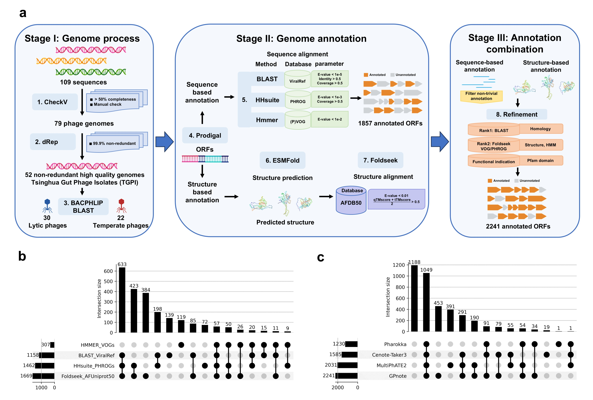

# GPnote - Gut phage annotation note

```shell
    ___
   /   \ 
  /__ __\   GGGG   PPPP   N   N  OOO TTTTTTT EEEEE
  |\/ \/|  G       P   P  NN  N O   O   T    E
  | ___ |  G  GG   PPPP   N N N O   O   T    EEEE
  \     /  G   G   P      N  NN O   O   T    E
   \___/   GGGG    P      N   N  OOO    T    EEEEE
  __ | __
 /  / \  \ 
/  /   \  \

Xiangye Lab, Tsinghua University
```

The low annotation rate of gut phages remains a major challenge in gut phage research. We developed a workflow called Gut Phage genome annotation note (GPnote) for phage genome annotation. GPnote is an automated de novo genome annotation pipeline that integrates both the sequence-based and structure-based predictions of gene functions. The overall annotation rate achieved about 57.5% on TGPI dataset (2,241/3,896 genes), much higher than current phage annotation pipelines (Pharokka, cenote-Taker3, multiPhATE2). GPnote significantly improves the functional annotation of phage structural proteins such as major capsid proteins, portal proteins and tail components. 



# Workflow

We employed **VIGA** (Gonzalez-Tortuero et al., 2018) as our annotation start point, which provides the BLAST Hit of RefSeq Viral and VOGs/pVOGs Hit by profile HMM search and further incorprated the HMM profile comparison Hits in **PHROGs** via hhsuite. Also we performed hmmsearch against Pfam database for more function indications. Besides all these sequence-based strategies, we achieved advanced structure-based annotation by **ESMFold** (Lin Zeming et al., 2023) structure prediction and **FoldSeek** (Michel van Kempen et al., 2023) 3Di+AA structure search against the **Alphafold-UniProt50** database.


# Kaggle notebooks

We have provided a user-friendly interface on Kaggle plaftorm for utilizing GPnote software without need to install locally (https://www.kaggle.com/code/colafish/gpnote/). You can easily annotate your phage genome by runing this notebook. The Kaggle version of GPnote has been modified with PDB database and HuggingFace ESMFold to suit for limited computational resources and can support single genome prediction. For batch predictions of large numbers of phage sequences, for example metagenomic data, local installation of GPnote on computers with GPUs is recommended.

# Compute Requirements

 In order to perform GPnote annotation, GPUs with at least 8GB of memory and free disk space at least 200GB are required. 

# Installation

To install GPnote locally, you need to first install miniconda or micromamba and pip.

Use conda and pip to install necessary packages:

```
conda create -n GPnote
conda activate GPnote
conda install -y -c bioconda -c conda-forge bcbio-gff numpy pandas scipy lastz Aragorn infernal piler-cr Prodigal diamond blast hmmer hhsuite foldseek
pip install --upgrade transformers==4.51.3 py3Dmol==2.5.1 accelerate==1.5.2
pip install biopython==1.79
pip install "fair-esm[esmfold]"
pip install 'dllogger @ git+https://github.com/NVIDIA/dllogger.git'
pip install 'openfold @ git+https://github.com/aqlaboratory/openfold.git'
```

or you can just use the command:

```
bash build_environment.sh
```

Once these dependencies are installed, the databases can be downloaded. GPnote incorporates both sequence and structure databases:

**Rfam:** RNA family database (https://rfam.org/)

**Refseq Viral protein: **NCBI Refseq virus proteins (https://ftp.ncbi.nlm.nih.gov/refseq/release/viral/)

**PHROGs:** Prokaryotic Virus Remote Homologous Groups database (https://phrogs.lmge.uca.fr/)

**VOGs/PVOGs: **Virus Orthologous Groups Database (https://vogdb.org/)

**RVDB:** Reference Viral Database (https://rvdb.dbi.udel.edu/)

**Pfam:**  Protein families database (https://pfam.xfam.org/)

**Alphafold-Uniprot50**

To install the database, you can use the command:

```
bash create_databases.sh
```

# Usage

```
usage: gpnote.py [-h] [--workdir WORKDIR] [--fastafile FASTAFILE] [--vigapath VIGAPATH] [--pfampath PFAMPATH] [--phrogspath PHROGSPATH] [--esmfoldpath ESMFOLDPATH] [--foldseekpath FOLDSEEKPATH]

WorkFlow for GPnote (Gut phage annotation)

optional arguments:
  -h, --help            show this help message and exit
  --workdir WORKDIR     workpath that contains the raw fasta file of the phage sequence 
  --fastafile FASTAFILE
                        fasta file name 
  --vigapath VIGAPATH   vigapath on your computer or cluster
  --pfampath PFAMPATH   pfampath on your computer or cluster
  --phrogspath PHROGSPATH
                        phrogspath on your computer or cluster 
  --esmfoldpath ESMFOLDPATH
                        esmfoldpath on your computer or cluster
  --foldseekpath FOLDSEEKPATH
                        foldseekpath on your computer or cluster 
```


To annotate single phage genome，you can use the command below. Make sure move to the **scripts** path and the input fasta file is in the specified working directory (e.g. test):

```
python gpnote.py --workdir test --fastafile test.fasta --vigapath GPnote_db --pfampath GPnote_db/HMMER_Pfam/Pfam-A.hmm --phrogspath  GPnote_db/HHsuite_PHROGs/phrogs --esmfoldpath esmfold --foldseek GPnote_db/foldseek_db/afdb
```

For batch prediction, you can use the command and make sure all input fasta files are in the same directory (e.g. gutphage):

```
python batchrun.py --batchdir gutphage --multicore 8
```

# Output

GPnote generates a lot of output files including intermediate files in each step. Each file and folder will have a prefix or suffix respective to the name of the input file.

**Useful outputs**

- Detailed protein annotation table: <input_file>_anno_result.tsv
- Formated annotation file: <input_file>_gpnote.txt
- Formated GPnote-annotated genbank file: <input_file>_gpnote.gbk
- Formated GPnote-annotated gene feature file: <input_file>_gpnote.gff

Examples:

All the sequences and predicted structures of our isolated TGPI phages can be downloaded (TGPI.zip)on https://cloud.tsinghua.edu.cn/d/1458cb9cfc6743058d57/. 


# Bugs and suggestions

If you come across any problems with GPnote , or would like to make any suggestions to improve the program, please open an issue on github. We are glad to receive user feedback.

# **Citation**

Our work has not been published yet and if you use it, please cite the GitHub repository https://github.com/MaoSihong/GPnote for now.

Please be sure to cite the following core dependencies and databases:

1.  VIGA - Gonzalez-Tortuero E, Sutton T, Veladhuyan V, Shkoporov A, Draper L, Stockdale S, et al. VIGA: a sensitive, precise and automatic de novo VIral Genome Annotator. 2018.
2. PHROGs - Terzian P, Olo Ndela E, Galiez C, Lossouarn J, Pérez Bucio RE, Mom R, et al. PHROG: families of prokaryotic virus proteins clustered using remote homology. NAR Genom Bioinform 2021; 3:lqab067.
3. ESMFold - Lin Z, Akin H, Rao R, Hie B, Zhu Z, Lu W, et al. Evolutionary-scale prediction of atomic-level protein structure with a language model. Science 2023; 379:1123-30.
4. FoldSeek - van Kempen M, Kim SS, Tumescheit C, Mirdita M, Lee J, Gilchrist CLM, et al. Fast and accurate protein structure search with Foldseek. Nat Biotechnol 2024; 42:243-6.
5. Alphafold database - Varadi, M *et al*. AlphaFold Protein Structure Database in 2024: providing structure coverage for over 214 million protein sequences. *Nucleic Acids Research* (2024).